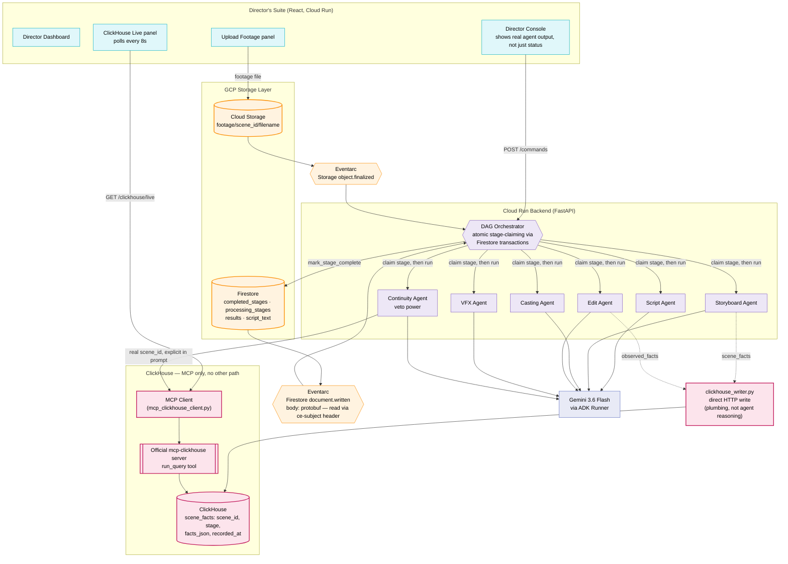

# System Architecture

Gemini agents, orchestrated via Google's Agent Development Kit (ADK, part of
the Gemini Enterprise Agent Platform), move a scene through a DAG-based film
production pipeline. Cloud Storage holds the real media payload; Firestore
holds only metadata and drives two Eventarc triggers; ClickHouse — queried
and written exclusively through its official MCP server — is the
continuity fact-check layer and the dashboard's live analytics source.

## Key design decisions

- **DAG, not swarm.** Storyboard and Casting only need `script` complete;
  Edit and VFX need `shoot` complete; Continuity needs `edit` complete. The
  orchestrator re-checks `completed_stages` on every invocation rather than
  assuming a linear order.
- **Firestore never stores media.** It holds scene status and `gs://`
  references only. Cloud Storage holds scripts, footage, storyboards, and
  renders.
- **Two Eventarc triggers, one gotcha.** The Cloud Storage trigger delivers
  a normal JSON body. The Firestore trigger does not — Firestore Eventarc
  events are always protobuf, and Google's API rejects
  `--event-data-content-type=application/json` outright for this event
  type. The backend sidesteps this entirely: it never parses the event
  body, it reads the changed document's ID from the `ce-subject` CloudEvents
  header (always plain text, regardless of body content type), then
  re-reads fresh state from Firestore itself.
- **Atomic stage claiming.** Because the orchestrator's own writes
  (`mark_stage_complete`) re-trigger the Firestore Eventarc trigger, two
  overlapping invocations can otherwise both see a stage as "not done yet"
  and both run it — wasting Gemini quota and writing duplicate ClickHouse
  rows. A Firestore transaction (`try_claim_stage`) makes the
  check-and-claim atomic across concurrent Cloud Run instances, not just
  within one process.
- **ClickHouse access has exactly one path.** Every read (Continuity
  Agent's reasoning, the dashboard's live stats) goes through the official
  `mcp-clickhouse` MCP server — real `run_query` tool calls, not a
  decorative badge. Writing scene facts in the first place is ordinary
  pipeline plumbing (`clickhouse_writer.py`), done via direct HTTP rather
  than routed through a read-oriented MCP server.
- **The Continuity Agent needs its real scene_id spelled out.** Early on,
  the agent inferred a scene_id-shaped word from the creative script text
  (e.g. guessing `'alley'` from "foggy alley") instead of using the actual
  ID, silently returning empty/meaningless query results. The fix: the
  orchestrator explicitly states the real `scene_id` in the prompt for this
  stage, rather than relying on the model to extract it correctly.
- **Agents fail honestly, not creatively.** If given non-scene input (e.g.
  a meta-question typed into the console by mistake), the Storyboard Agent
  is instructed to say so rather than hallucinate a fictional scene — matching
  how the Script and Casting agents already behaved.
- **Auxiliary writes never crash the pipeline.** A ClickHouse write timeout
  is caught and logged, not allowed to fail the whole request — the
  creative work (Gemini's output) already succeeded and should still be
  marked complete.
