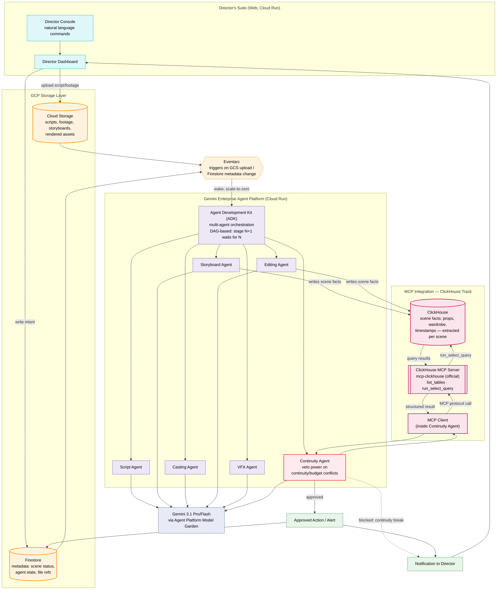

# System Architecture

Gemini agents, orchestrated via Google's Agent Development Kit (ADK, part of
the Gemini Enterprise Agent Platform), move a scene through a DAG-based film
production pipeline. Cloud Storage holds the real media payload; Firestore
holds only metadata and drives the Eventarc trigger; ClickHouse — queried
through its official MCP server — is the continuity fact-check layer.

## Key design decisions

- **DAG, not swarm.** Unlike a fan-out pattern where independent agents run
  in parallel, film production has real dependencies (you can't cast before
  a script exists). The ADK orchestrator only dispatches a stage once its
  prerequisite stage has written `status: complete` to Firestore.
- **Firestore never stores media.** It holds scene status, stage, and `gs://`
  references only. Cloud Storage holds scripts, footage, storyboards, and
  renders.
- **Eventarc, not polling.** The backend wakes only on a real Firestore
  write or Cloud Storage upload. Cloud Run scales to zero otherwise.
- **Real MCP usage, not a mention.** The Continuity Agent's only path to
  ClickHouse is the official `mcp-clickhouse` server, called via the MCP
  protocol from Python (`backend/services/mcp_clickhouse_client.py`) — see
  that file for the exact tool calls (`run_select_query`).
- **Safety-first arbitration.** The Continuity Agent can block an action
  outright if it finds a continuity mismatch or a VFX cost estimate that
  breaks budget — mirroring how a producer would actually intervene.
